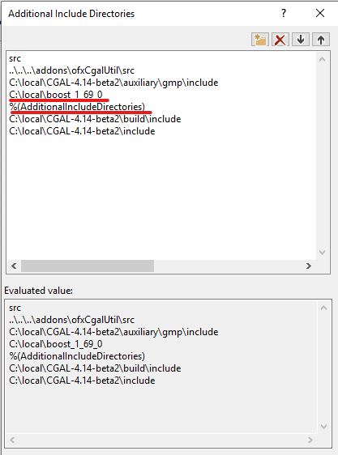

# ofxCgalUtil
openFrameworks addon to bridge CGAL. Currently aiming to support Windows only.

## 0. About CGAL
* The Computational Geometry Algorithms Library [CGAL](https://www.cgal.org/)
* [Installation](https://www.cgal.org/download.html)
  * Build library along with the documents
* After the installation, check your environment variables to have `CGAL_DIR`, `BOOST_INCLUDEDIR`, `BOOST_LIBRARYDIR`.

## 1. Build your project
* Using Project Generator(PG), update your oF project directory.
* Change the order of the list on `properties` > `C/C++` > `General` > `Additional Include Directories` to have the boost path upper than `%(AdditionalIncludeDirectories)`. Otherwise, you can't build because of conflict coming from Boost version of oF's and one used by CGAL.
  
